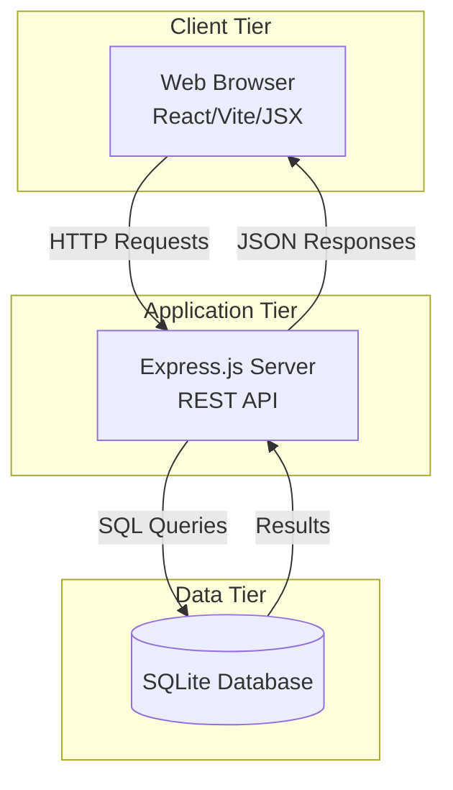
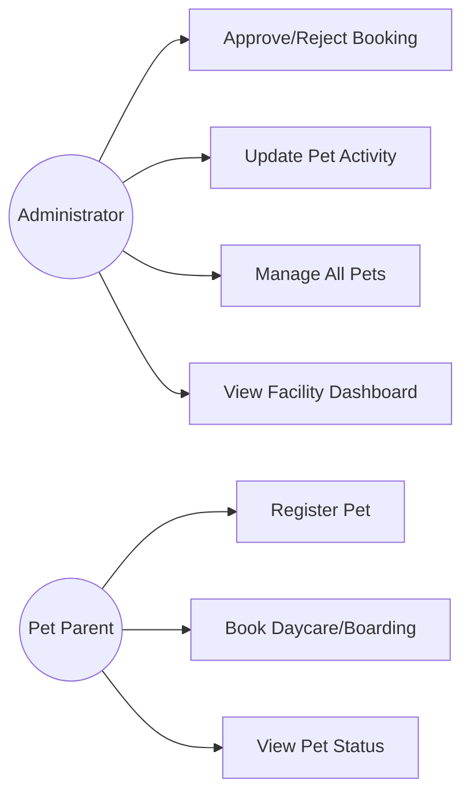
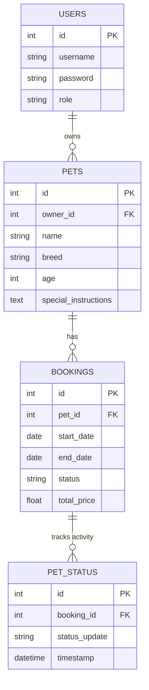

# Software Requirements Specification (SRS)
## Pet Daycare & Boarding System
**Version:** 1.0  
**Date:** 2026-04-02  
**Author:** Antigravity AI

---

## 1. Introduction

### 1.1 Purpose
This document specifies the software requirements for the **Pet Daycare & Boarding System (PDBS)** — a web-based application designed to streamline the operations of pet care facilities, enabling efficient management of pet profiles, boarding bookings, and real-time status updates for pet parents.

### 1.2 Scope
The PDBS provides:
- User and Admin authentication with role-based access.
- Pet profile registration and management.
- Daycare and Boarding booking management.
- Real-time pet status updates (feeding, walking, napping).
- Admin dashboard for facility oversight and booking approvals.
- User dashboard for pet parents to track their pets' stay.

### 1.3 Definitions & Acronyms
| Term | Definition |
|------|-----------|
| PDBS | Pet Daycare & Boarding System |
| CRUD | Create, Read, Update, Delete |
| JWT | JSON Web Token (Authentication) |
| SPA | Single Page Application |
| Admin | Daycare Owner/Staff managing the facility |
| User | Pet Parent using the system to book stays |

---

## 2. Overall Description

### 2.1 Product Perspective
The PDBS is a standalone web application using a 3-tier architecture:

### 2.2 Product Features Summary
1. **Authentication** – Separate login flows for Users and Admins.
2. **Pet Management** – Register pets with breed, age, and special instructions.
3. **Booking System** – Book stays with start/end dates.
4. **Real-time Status** – Admins update pet activities; Users view updates instantly.
5. **Admin Dashboard** – Overview of all bookings, pets, and facility status.
6. **User Dashboard** – Manage personal pets and active bookings.

### 2.3 User Classes
| User Class | Description |
|-----------|-------------|
| Administrator | Full access — approves bookings, updates pet status, manages all records. |
| User (Pet Parent) | Limited access — manages own pets, creates bookings, views status. |

---

## 3. Functional Requirements

### 3.1 Use Case Diagram

### 3.2 User Management
| ID | Requirement | Priority |
|----|------------|----------|
| FR-01 | System shall allow users to register as Pet Parents. | High |
| FR-02 | System shall provide separate login portals for Users and Admins. | High |
| FR-03 | System shall use JWT for secure session management. | High |

### 3.3 Pet Management
| ID | Requirement | Priority |
|----|------------|----------|
| FR-04 | Users shall be able to add/edit pet profiles (Name, Breed, Age, Instructions). | High |
| FR-05 | Admins shall be able to view and manage all pet profiles. | High |

### 3.4 Booking & Status
| ID | Requirement | Priority |
|----|------------|----------|
| FR-06 | Users shall be able to request boarding/daycare for specific dates. | High |
| FR-07 | Admins shall be able to confirm or cancel booking requests. | High |
| FR-08 | Admins shall provide real-time updates (e.g., "Mochi is napping"). | High |
| FR-09 | Users shall see a timeline of status updates for their pet's active stay. | Medium |

---

## 4. Non-Functional Requirements

| ID | Category | Requirement |
|----|---------|------------|
| NFR-01 | **Performance** | Dashboard should load within 1 second for standard data sets. |
| NFR-02 | **Security** | Passwords must be hashed using bcrypt. |
| NFR-03 | **Usability** | The UI must use a "Premium Dark Theme" with high contrast and intuitive navigation. |
| NFR-04 | **Reliability** | SQLite database should maintain data integrity during concurrent role-based access. |

---

## 5. Entity-Relationship Diagram

